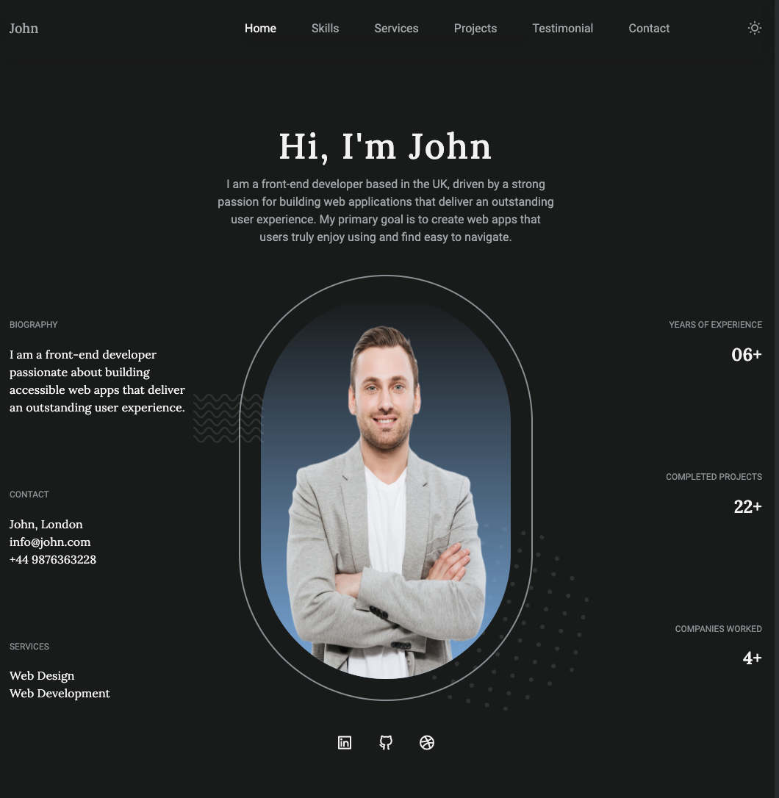

# Dark & Light Mode Portfolio Website

## Table of contents

- [Overview](#overview)
  - [Screenshot](#screenshot)
  - [Links](#links)
- [Key Features](#key-process)
  - [Modern and Responsive Design](#modern-and-responsive-design)
  - [Portfolio Showcase](#portfolio-showcase)
  - [Dark & Light Mode Theme](#dark-&-light-mode-theme)
  - [Tailwind CSS Styling](#tailwind-css-styling)
  - [Vanilla JavaScript Functionality](#vanilla-javascript-functionality)
- [Technical Details](#technical-details)
  - [HTML Structure](#html-structure)
  - [Tailwind CSS Implementation](#tailwind-css-implementation)
  - [SwiperJS Slider Integration](#swiperjs-slider-integration)
  - [Local Storage Theme Persistence](#local-storage-theme-persistence)
  - [Author](#author)

## Overview

The Dark & Light Mode Portfolio Website is a stunning and modern single-page web application that showcases a portfolio of a creative individual or professional. Built using HTML, Tailwind CSS, Vanilla JavaScript, and the SwiperJS library for sliders, the website offers a smooth and engaging user experience. Inspired by the design concepts from Bedimcode, the website features two distinct themes: a sleek and sophisticated dark mode and a clean and minimalistic light mode. Users can easily switch between the themes, and their preference is automatically saved using Local Storage, ensuring a consistent experience across visits.

### Screenshot

 (./src/images/screenshot_dark.png)

### Links

- Solution URL: [Solution](https://github.com/suhel-uis/vanilla-javascript-projects/tree/main/portfolio-website)
- Live Site URL: [Add live site URL here]()

## Key Features

### Modern and Responsive Design

The website boasts a contemporary and responsive layout that adapts seamlessly to different screen sizes and devices, providing an optimal browsing experience for users on desktops, tablets, and smartphones.

### Portfolio Showcase

The primary focus of the website is to display a captivating portfolio, showcasing the creator's work, projects, or services. Utilizing SwiperJS, the portfolio section presents a dynamic and interactive slider, allowing users to effortlessly navigate through the various pieces of work.

### Dark & Light Mode Theme

The website incorporates both dark and light modes, enhancing user accessibility and personalization. Visitors can easily toggle between the two themes to suit their preferences, with the chosen theme persistently remembered across sessions thanks to Local Storage integration.

### Tailwind CSS Styling

Tailwind CSS, a utility-first CSS framework, has been employed to streamline the design process. Its powerful utility classes make it easy to achieve consistent and visually appealing styles throughout the website.

### Vanilla JavaScript Functionality

The website's interactivity is achieved using Vanilla JavaScript, providing a lightweight and fast user experience. From theme switching to navigation animations, JavaScript enhances the website's dynamism without relying on heavy external libraries.

## Technical Details

### HTML Structure

The HTML structure is organized into sections for clear content separation, including the header, hero section, portfolio slider, about section, contact form, and footer. The code adheres to best practices for semantic HTML markup.

### Tailwind CSS Implementation

Tailwind CSS classes have been strategically applied to elements to define the website's appearance. The utility-first approach allows for quick and precise styling, reducing the need for custom CSS.

### SwiperJS Slider Integration

The SwiperJS library is used to create a smooth and engaging portfolio slider. Its intuitive API enables easy navigation and provides a seamless user experience for browsing through projects.

### Local Storage Theme Persistence

By utilizing Local Storage, the user's theme preference (dark or light mode) is saved, allowing the website to load their chosen theme automatically during subsequent visits.

### Author

- Website - [Suhel](https://www.your-site.com)
